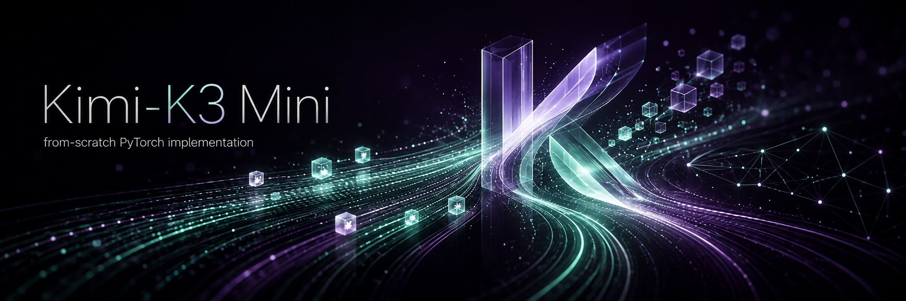

<p align="center">
  
</p>

--- 

### A research-scale Kimi K3 reproduction—from 213M single-T4 profiles to the canonical topology in pure PyTorch

[](https://github.com/pablo-reyes8/kimi-k3/actions/workflows/ci.yml)
[](https://www.python.org/)
[](https://pytorch.org/)
[](LICENSE)
[](#project-status)

Kimi-K3 Mini is a pure-PyTorch reproduction of the core architectural, training, and inference mechanisms introduced in Kimi K3. It scales the frontier system down into readable, modular components that you can validate locally on a CPU, compose via strict YAML profiles, and rapidly scale up for real GPU experiments.

This is not just a Transformer renamed after Kimi. The repository delivers a faithful, from-scratch reconstruction of the paper's main innovations: Kimi Delta Attention, Gated Multi-head Latent Attention, the hybrid 3:1 backbone, and Stable LatentMoE. Built with multimodal research in mind, it also includes native MoonViT integration, Attention Residuals, MTP, progressive context training, and cached autoregressive inference.

> [!IMPORTANT]
> This is an independent research implementation. It is not affiliated with
> Moonshot AI, does not ship official or trained weights, and does not reproduce
> Moonshot's production PP/VP/CP/MoonEP system, data mixture or custom kernels.

## Contents

- [Complete YAML profiles](#complete-yaml-profiles)
- [Why this repository exists](#why-this-repository-exists)
- [Implementation status](#implementation-status)
- [Architecture](#architecture)
- [Installation](#installation)
- [Quick start](#quick-start)
- [Supported data](#supported-data)
- [Training](#training)
- [Inference](#inference)
- [Testing and CI](#testing-and-ci)
- [Docker](#docker)
- [Repository layout](#repository-layout)
- [Documentation](#documentation)
- [Project status](#project-status)
- [Citation and license](#citation-and-license)

## Why this repository exists

Large-model reports are easiest to understand when their mechanisms can be
isolated, inspected and tested. This project provides:

- paper-oriented modules instead of one opaque model file;
- exact behavioral tests for equations, causality, masks, caches and gradients;
- tiny CPU configurations for development and larger research profiles;
- one public training orchestration path;
- one public autoregressive inference path;
- explicit boundaries between implemented research code and future systems
  work.

The canonical topology is represented as validated metadata, while smaller
profiles make the same composition practical for local experimentation.
The architectural reference bundled with the repository is
[_Kimi K3: Open Frontier Intelligence_](paper/k3_tech_report.pdf).

## Complete YAML profiles

The center of the repository is a ladder of complete experiments. Every
profile binds the dataset, architecture and training recipe into one directory:

```text
config/kimi_full_pipeline/<profile>/
├── data.yaml
├── model.yaml
└── training.yaml
```

### Choose a compute budget

| Profile        | Total / active parameters | Approx. train compute | GPU target                   |                        Context | Data                |
| -------------- | ------------------------: | --------------------: | ---------------------------- | -----------------------------: | ------------------- |
| `cpu_smoke`    |             0.05M / 0.04M |    <0.001 GFLOP/token | CPU                          |                             32 | Synthetic retrieval |
| `low_gpu`      |             87.2M / 56.6M |      0.34 GFLOP/token | Conservative T4              |                            512 | WikiText-2          |
| `t4_wikitext`  |           212.9M / 108.5M |      0.65 GFLOP/token | T4 16 GB (~15 usable) target |                          1,024 | WikiText-2          |
| `t4_retrieval` |           246.6M / 120.2M |      0.72 GFLOP/token | T4 16 GB (~15 usable) target |                512 → 2,048 PCC | Synthetic retrieval |
| `gpu_24gb`     |           371.3M / 190.9M |      1.15 GFLOP/token | 24 GB GPU                    |                          1,024 | FineWeb 10BT        |
| `gpu_48gb`     |          1.482B / ~556.7M |     ~3.34 GFLOP/token | 48 GB GPU                    |                      8,192 PCC | FineWeb 100BT       |
| `gpu_80gb`     |           ≥7.66B / ≥1.91B |    ≥11.46 GFLOP/token | 80 GB GPU                    |                      8,192 PCC | FineWeb 350BT       |
| `canonical`    |               2.8T / 104B |      ≈624 GFLOP/token | Distributed metadata         | 8,192 recipe / 1M architecture | FineWeb 350BT       |

Active-parameter estimates account for sparse top-k experts. Training compute
uses the common `6 × active parameters` approximation per token. It is a scale
indicator, not measured throughput: attention, KDA recurrence, routing,
MoonViT, MTP, sequence length and kernels add workload. The remaining `≥` row
reports the text stack before the additional visual path. GPU labels are starting targets;
peak memory must be measured on the actual PyTorch/CUDA stack.

### Distributed launch profiles

The same three-YAML control plane now describes the process topology. These
profiles are executable PyTorch baselines, not production-system claims:

| Profile | Processes | Composition | Starting hardware/data |
|---|---:|---|---|
| `distributed_ddp_2x_t4` | 2 | 2-way DDP | 2 × T4, synthetic retrieval |
| `distributed_tp_2x_24gb` | 2 | 2-way complete-head TP | 2 × 24 GB, FineWeb 10BT |
| `distributed_tp_ep_4x_24gb` | 4 | 2-way TP × 2-way EP | 4 × 24 GB, FineWeb 10BT |

Validate topology, divisibility and the exact launch command without building
data or allocating the model:

```bash
python -m scripts.validate_distributed_config \
  --profile config/kimi_full_pipeline/distributed_tp_ep_4x_24gb
```

Launch the same validated profile:

```bash
torchrun --standalone --nproc_per_node=4 \
  -m scripts.train_kimi \
  --profile config/kimi_full_pipeline/distributed_tp_ep_4x_24gb
```

### Two practical T4 starting points

The new T4 profiles use the small vocabulary or corpus size differently:
retrieval spends the saved embedding budget on width and context, while
WikiText keeps a larger language vocabulary.

| Architecture field        |           `t4_retrieval` |            `t4_wikitext` | Canonical metadata |
| ------------------------- | -----------------------: | -----------------------: | -----------------: |
| Total / active parameters |          246.6M / 120.2M |          212.9M / 108.5M |        2.8T / 104B |
| Hybrid attention stack    |            9 KDA + 4 MLA |            9 KDA + 4 MLA |    69 KDA + 24 MLA |
| Model width               |                      704 |                      640 |              7,168 |
| Heads / head size         |                  11 / 64 |                  10 / 64 |           56 / 128 |
| Routed experts            |                12, Top-2 |                12, Top-2 |        896, Top-16 |
| Latent MoE width          |                      352 |                      320 |              3,584 |
| Vocabulary                |  2,048 controlled tokens |       16K byte-level BPE |               160K |
| Context recipe            |       PCC: 512 → 1K → 2K |                 Fixed 1K |      Configured 8K |
| Optimizer                 |    Per-Head Muon + AdamW |    Per-Head Muon + AdamW |       Muon + AdamW |
| Vision                    | Disabled for T4 headroom | Disabled for T4 headroom |            MoonViT |

At a rough 12–16 bytes per parameter for weights, gradients and mixed
optimizer state, persistent model state is approximately 2.8–3.7 GiB for
`t4_retrieval` and 2.4–3.2 GiB for `t4_wikitext`. Activations, attention
workspaces, routing buffers, CUDA context and fragmentation consume the
remaining VRAM; this is why both recipes use microbatch 1, accumulation, FP16
and no EMA.

Scaling down does not replace the defining blocks with a generic Transformer.
Both T4 profiles retain the `3 KDA : 1 Gated MLA` rhythm, ShortConv KDA,
Stable LatentMoE, Block Attention Residuals, Quantile Balancing, MTP,
Kimi-aware optimization and native KDA/MLA cached decoding.

### Validate, train and generate

Validate all three YAML contracts without downloading data or allocating the
model:

```bash
PROFILE=config/kimi_full_pipeline/t4_retrieval
python -m scripts.validate_data_config "$PROFILE/data.yaml"
python -m scripts.validate_model_config "$PROFILE/model.yaml"
python -m scripts.train_kimi --profile "$PROFILE" --validate-only
```

Start a real run only when the selected data and hardware are ready:

```bash
python -m scripts.train_kimi \
  --profile config/kimi_full_pipeline/t4_retrieval
```

After training, use the same profile for cached generation:

```bash
python -m scripts.infer_kimi \
  --profile config/kimi_full_pipeline/t4_retrieval \
  --checkpoint checkpoints/t4_retrieval_246m/model.pt \
  --inference-config config/inference/creative.yaml \
  --prompt "key_7 is value_42"
```

Interactive walkthroughs:

- [Train from one complete YAML profile](notebooks/train_kimi_k3_from_yaml.ipynb)
- [Run autoregressive cached inference](notebooks/inference_kimi_k3_from_checkpoint.ipynb)

Unknown YAML fields fail loudly, and cross-profile contracts are validated
before the data or model is built.

## Implementation status

| Area                    | Included                                                                                                         |
| ----------------------- | ---------------------------------------------------------------------------------------------------------------- |
| Kimi Delta Attention    | Recurrent, chunkwise, prefill and decode paths; short-convolution state; data-dependent decay; FP32 accumulation |
| Gated MLA               | NoPE global attention, compressed latent KV, full-rank output gate, manual/SDPA backends and cache               |
| Hybrid backbone         | Repeated `3 KDA + 1 Gated MLA`, final global MLA and synchronized heterogeneous cache                            |
| Stable LatentMoE        | Shared experts, latent routed experts, sparse top-k dispatch, exact/histogram Quantile Balancing                 |
| Attention Residuals     | Full and Block AttnRes with eager and exact two-phase execution                                                  |
| Vision                  | MoonViT, hierarchical and Swin variants, pixel shuffle, projection and image/video token composition             |
| MTP                     | One auxiliary `x[t+2]` prediction group with normalized fusion and shared LM head                                |
| Objectives              | NTP, MTP, trajectory SFT, policy optimization and multi-teacher on-policy distillation                           |
| Training                | Train/eval epochs, AMP, accumulation, EMA, checkpoints, scheduler, previews and structured diagnostics           |
| Kimi optimizers         | AdamW, Muon/AdamW hybrid, per-head QKV handling and QK-Clip                                                      |
| Long-context curriculum | Optional Progressive Context Curriculum with resumable stage state                                               |
| Distributed execution   | DDP, FSDP boundary, complete-head KDA/MLA TP, tied vocabulary shards, no-drop MoE EP and atomic rank checkpoints |
| Inference               | Checkpoint restoration, greedy/sampling generation and native KDA/MLA cached decode                              |
| Configuration           | Strict data/model/training YAMLs grouped into complete experiment profiles                                       |

The full component map is available in
[`src/kimi_components/README.md`](src/kimi_components/README.md).

## Architecture

```text
text token IDs ──> token embeddings ──────────────┐
                                                  │
images/videos ──> MoonViT ─> projector/composer ──┤
                                                  ▼

                                    repeated hybrid groups
                                  [3 × KDA + 1 × Gated MLA]
                                            │
                                Stable LatentMoE after attention
                                            │
                                Full or Block Attention Residuals
                                            │
                                  final global Gated MLA + MoE
                                            │
                                    RMSNorm + tied LM head
                                      ┌─────┴─────┐
                                  NTP logits   MTP x[t+2]
```

The canonical metadata profile describes:

- `d_model = 7168`;
- 56 attention heads;
- 23 hybrid groups plus the final Gated MLA, for 93 attention layers;
- 896 routed experts with 16 selected per token;
- a 160,000-token model vocabulary;
- MoonViT visual encoding and one MTP group.

Loading the canonical YAML validates this topology without allocating its
weights. Do not instantiate it casually.

## Installation

Python 3.10 or newer is required.

```bash
git clone https://github.com/pablo-reyes8/kimi-k3.git
cd kimi-k3
python -m venv .venv
source .venv/bin/activate
python -m pip install --upgrade pip
python -m pip install -e ".[dev,data]"
```

On Windows PowerShell:

```powershell
.venv\Scripts\Activate.ps1
python -m pip install -e ".[dev,data]"
```

The minimal architecture/inference dependencies are installed with
`pip install -e .`. The `data` extra adds Hugging Face datasets and
tokenizers; `dev` adds pytest.

## Quick start

Validate a complete low-GPU experiment without downloading data, allocating a
model or training:

```bash
python -m scripts.train_kimi \
  --profile config/kimi_full_pipeline/t4_retrieval \
  --validate-only
```

The same operation through the Makefile:

```bash
make validate PROFILE=config/kimi_full_pipeline/t4_retrieval
```

Interactive examples:

- [`notebooks/train_kimi_k3_from_yaml.ipynb`](notebooks/train_kimi_k3_from_yaml.ipynb)
- [`notebooks/inference_kimi_k3_from_checkpoint.ipynb`](notebooks/inference_kimi_k3_from_checkpoint.ipynb)

## Supported data

The data orchestrator owns tokenization, causal blocks, loaders and the
context-aware loader factory used by PCC.

| Family                    | Presets                                              |
| ------------------------- | ---------------------------------------------------- |
| Local synthetic           | Deterministic long-context key/value retrieval       |
| Compact Hugging Face text | WikiText-2, TinyStories, AG News, IMDB, MiniPile     |
| Educational web           | FineWeb-Edu 10BT-mincols                             |
| Progressive LLM scale     | FineWeb`sample-10BT`, `sample-100BT`, `sample-350BT` |

Hugging Face profiles can cap tokenizer, train and validation documents and
cache a byte-level BPE tokenizer. The three FineWeb profiles enable streaming
and document caps by default so selecting one does not eagerly download the
27.6 GB, 277.4 GB or roughly 388 GB remote source. Unit tests never download
datasets.

Standalone YAMLs for these sources live under [`config/data/`](config/data/).
Removing the document caps is an explicit large-scale operation and should
only be done with a deliberate storage and preprocessing plan.

Build a configured data bundle:

```python
from data import build_dataloaders_from_yaml

data = build_dataloaders_from_yaml(profile.data)
train_loader = data.train_loader
val_loader = data.val_loader
```

For inference, `load_tokenizer_from_data_yaml` reconstructs the deterministic
synthetic tokenizer or loads the cached tokenizer without rebuilding loaders.

## Training

The notebook and CLI use three public calls in order:

```python
from data import build_dataloaders_from_yaml
from src import build_model_from_yaml
from training import train_kimi_from_yaml

data = build_dataloaders_from_yaml(profile.data)
model = build_model_from_yaml(profile.model, data_bundle=data)
history = train_kimi_from_yaml(
    profile.training,
    model=model,
    data=data,
)
```

`train_kimi_from_yaml` validates cross-file invariants and delegates to the
single master orchestrator, `train_kimiK3`. The training YAML controls:

- precision, epochs, accumulation and gradient clipping;
- NTP/MTP loss configuration;
- AdamW or Kimi-style Muon/AdamW parameter groups;
- warmup and cosine scheduling;
- EMA and EMA evaluation;
- structured loss, routing, gradient and numerical diagnostics;
- progressive context stages;
- checkpoint/resume behavior;
- periodic next-token qualitative previews.

To start a real run from the CLI, remove `--validate-only`:

```bash
python -m scripts.train_kimi \
  --profile config/kimi_full_pipeline/t4_retrieval
```

This may download/tokenize data and allocate the configured model.

Distributed profiles use the same master function and are launched with
`torchrun`; the YAML remains the source of truth:

```bash
torchrun --standalone --nproc_per_node=2 \
  -m scripts.train_kimi \
  --profile config/kimi_full_pipeline/distributed_ddp_2x_t4
```

The model is transformed in place: KDA and MLA own complete local heads,
KDA recurrent/ShortConv caches follow those heads, MLA keeps the compressed
latent cache replicated, tied vocabulary weights are sharded once, and routed
experts use no-drop variable `all_to_all`. DDP/EP token losses and PCC counters
are reduced by valid-token count. Pipeline and context parallel sizes are
strictly reserved at `1` in this phase.

## Inference

Inference restores the architecture from `model.yaml`, loads a training
checkpoint and performs one prompt prefill followed by one cached decode step
per generated token:

```text
prompt -> KimiK3.prefill() -> HybridBackboneCache
       -> KimiK3.decode_step() -> next token -> repeat
```

KDA layers retain recurrent matrix and short-convolution state; MLA layers
retain compressed latent KV state. The full prefix is not recomputed.

```python
from data import load_tokenizer_from_data_yaml
from inference import (
    ModelLoadConfig,
    inference_autoregressive,
    load_generation_config,
    load_kimi_checkpoint,
)

tokenizer = load_tokenizer_from_data_yaml(profile.data)
loaded = load_kimi_checkpoint(
    profile.model,
    "checkpoints/model.pt",
    tokenizer=tokenizer,
    load_config=ModelLoadConfig(device="cuda", precision="fp16"),
)
generation = load_generation_config("config/inference/creative.yaml")
output = inference_autoregressive(
    loaded.model,
    "Once upon a time",
    tokenizer=tokenizer,
    generation_config=generation,
)
print(output.completion_text)
```

CLI:

```bash
python -m scripts.infer_kimi \
  --profile config/kimi_full_pipeline/t4_wikitext \
  --checkpoint checkpoints/model.pt \
  --inference-config config/inference/creative.yaml \
  --prompt "Once upon a time"
```

Sampling supports greedy decoding, temperature, top-k, top-p, repetition
penalty and deterministic seeds. See [`inference/README.md`](inference/README.md).

Two-way cached inference can use
`config/inference/distributed_greedy_tp2.yaml` under `torchrun`. It expects a
consolidated trusted checkpoint; same-topology training checkpoints remain
rank-sharded directories.

> [!WARNING]
> Only load checkpoints from trusted sources. PyTorch checkpoint
> deserialization is not a safe boundary for arbitrary files.

## Testing and CI

Tests are treated as architectural specifications. They check reference
equations, parameter wiring, causality, padding, gradients, BF16 behavior,
serialization and full-vs-cached equivalence—not only output shapes.

```bash
make check             # configuration + inference contracts
make test-config
make test-inference
make test-training
make test-distributed
make test              # complete CPU-safe suite
```

The GitHub Actions workflow classifies changed paths:

| Change                                                    | CI lane                                                  |
| --------------------------------------------------------- | -------------------------------------------------------- |
| README/docs/community files only                          | Classification only; no full test suite                  |
| YAML/configuration                                        | Profile parsers, cross-file contracts and CLI validation |
| Inference/cache code                                      | Focused inference tests                                  |
| Architecture, data, training, dependencies or broad tests | Full CPU suite plus CLI validation                       |
| Docker files                                              | Container build and focused container smoke              |

Workflows use read-only token permissions, concurrency cancellation and pinned
action revisions. CUDA checks skip safely when CUDA is unavailable.

The detailed invariant matrix is in [`docs/testing.md`](docs/testing.md).

## Docker

The supplied image is a reproducible CPU validation/inference environment. It
uses a multi-stage build, installs optional data dependencies and runs as a
non-root user.

```bash
docker compose run --rm validate
docker compose --profile test run --rm tests
docker compose --profile dev run --rm shell
```

Checkpoint inference:

```bash
KIMI_CHECKPOINT=checkpoints/model.pt \
KIMI_PROMPT="Once upon a time" \
docker compose --profile inference run --rm inference
```

The checkpoint and tokenizer-cache mounts are read-only. GPU execution needs a
CUDA-compatible PyTorch base image/runtime and is intentionally not implied by
the default CPU container.

## Repository layout

```text
.
├── config/kimi_full_pipeline/  # complete data/model/training profiles
├── configuration/              # strict YAML and profile resolution
├── data/                       # synthetic and Hugging Face LM pipelines
├── src/                        # KDA, MLA, MoE, AttnRes, vision, MTP, losses
├── training/                   # master trainer, optimizer, diagnostics, PCC
├── inference/                  # loading, sampling, prefill/decode and cache
├── scripts/                    # training, inference and validation CLIs
├── notebooks/                  # end-to-end Jupyter examples
├── tests/                      # CPU-safe behavioral and numerical tests
├── docs/                       # phase reports and public contracts
├── paper/                      # local technical-report reference
├── Dockerfile
├── docker-compose.yml
└── Makefile
```

## Documentation

Recommended entry points:

- [YAML training pipeline](docs/yaml_training_pipeline.md)
- [Kimi component map](src/kimi_components/README.md)
- [Master forward contract](docs/kimi_k3_forward_contract.md)
- [KDA implementation report](docs/kda_phase_report.md)
- [Gated MLA implementation report](docs/mla_phase_report.md)
- [Hybrid backbone report](docs/hybrid_backbone_phase_report.md)
- [Stable LatentMoE report](docs/stable_latent_moe_phase_report.md)
- [Attention Residuals report](docs/attention_residuals_phase_report.md)
- [MTP alignment and scope](docs/mtp_phase_report.md)
- [Training engine](docs/basic_training_phase_report.md)
- [Optimizer and diagnostics](docs/training_phase_2_optimizer_diagnostics_report.md)
- [Progressive Context Curriculum](docs/training_phase_3_progressive_context_curriculum_report.md)
- [Distributed parallelism](docs/distributed_parallelism_phase_report.md)
- [Distributed training guide](docs/distributed_training.md)
- [Distributed inference and cache guide](docs/distributed_inference_and_cache.md)

## Project status

The architecture, pretraining engine, YAML control plane, PyTorch-native
DP/TP/EP baseline and cached inference pipeline are implemented. The remaining
public milestones are:

1. **Train a proof model — in progress.** Run and publish a small end-to-end
   checkpoint with reproducible curves and qualitative generations.
2. **Integrate post-training.** SFT, RL/policy-optimization and multi-teacher
   distillation losses already exist under `src/loss/`; their datasets,
   rollout/teacher orchestration and checkpointed training pipeline remain to
   be connected.
3. **Measure and tune distributed GPU profiles.** Publish real memory,
   throughput and scaling measurements; PP, KDA context parallelism and
   MoonEP-style production kernels remain explicitly out of scope.

Production serving kernels, paged attention, continuous batching, quantized
caches and speculative MTP decoding are also outside the current scope.

## Citation and license

GitHub exposes citation metadata from [`CITATION.cff`](CITATION.cff). Please
cite the original Kimi K3 technical report first:

```bibtex
@techreport{kimi_team_kimi_k3_2026,
  author        = {{Kimi Team}},
  title         = {Kimi K3: Open Frontier Intelligence},
  year          = {2026},
  eprint        = {2607.24653},
  archivePrefix = {arXiv},
  primaryClass  = {cs.CL},
  doi           = {10.48550/arXiv.2607.24653},
  url           = {https://arxiv.org/abs/2607.24653}
}
```

If this implementation itself was useful, cite the software as well:

```bibtex
@software{reyes_kimi_k3_mini_2026,
  author  = {Pablo Reyes},
  title   = {Kimi-K3 Mini},
  year    = {2026},
  url     = {https://github.com/pablo-reyes8/kimi-k3},
  version = {0.0.1}
}
```

The project is released under the [MIT License](LICENSE). Generic Transformer,
data and training infrastructure was adapted from the author's MIT-licensed
DeepSeek-V4 Mini project; there are no runtime imports from that repository.
Kimi K3 itself and its technical report are the work of the Kimi Team.

Contributions are welcome. Read [`CONTRIBUTING.md`](CONTRIBUTING.md),
[`CODE_OF_CONDUCT.md`](CODE_OF_CONDUCT.md) and [`SECURITY.md`](SECURITY.md)
before opening a pull request or report.
